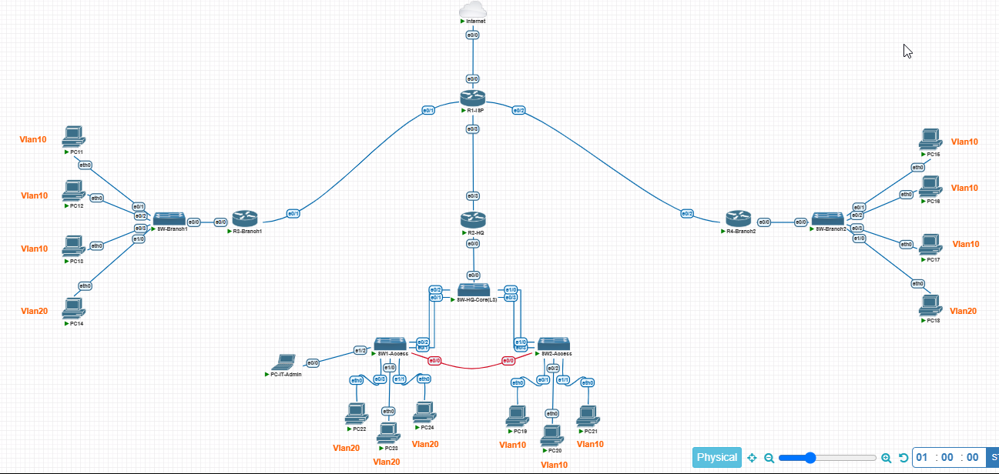

# Comprehensive Enterprise Lab — HQ + 2 Branches

A full-scale Cisco IOS lab built in **pnetlab**, simulating a small enterprise network with a headquarters and two branch offices — built and verified layer by layer: **Layer 2 first, then Layer 3/Routing/NAT/DHCP, then ACL/SSH security** — matching a real-world deployment workflow.

This is the third and most comprehensive lab in a series exploring core networking concepts hands-on. The first two labs covered NAT vs PAT in isolation; this one integrates that knowledge into a full enterprise topology alongside routing, VLANs, redundancy, and access control.

## 🎯 Lab Objectives

- Design and implement a 3-site enterprise network (HQ + 2 Branches) behind a simulated ISP
- Configure VLANs and trunking, with two different Inter-VLAN Routing approaches (L3 switch at HQ, Router-on-a-Stick at branches)
- Build real link redundancy with EtherChannel (LACP) and verify Rapid PVST actively blocks a redundant path
- Run OSPF (single area) across all sites for dynamic routing
- Centralize DHCP on the HQ core switch, relayed to branch VLANs via `ip helper-address`
- Implement PAT (NAT Overload) at the network edge for all outbound internet traffic
- Restrict SSH management access with an ACL — only the IT VLAN may reach the management network
- Verify every piece with real command output — no theoretical claims, only screenshots from a running lab

## 🖧 Topology

| Node | Role |
|---|---|
| **Internet** | Simulates the public internet (loopback target for reachability tests) |
| **R1-ISP** | Central hub router — performs PAT overload for all outbound traffic |
| **R2-HQ** | HQ edge router, OSPF |
| **R3-Branch1 / R4-Branch2** | Branch edge routers — Router-on-a-Stick for Inter-VLAN Routing, OSPF |
| **SW-HQ-Core (L3)** | HQ core switch — Inter-VLAN Routing via SVIs, central DHCP server |
| **SW1-Access / SW2-Access** | HQ access switches — EtherChannel to core, redundant link to each other |
| **SW-Branch1 / SW-Branch2** | Branch access switches — trunk to branch router, access ports to hosts |

## 📋 VLAN Plan

| VLAN | Name | HQ Subnet | Branch1 Subnet | Branch2 Subnet |
|---|---|---|---|---|
| 10 | Staff | 192.168.10.0/24 | 192.168.11.0/24 | 192.168.12.0/24 |
| 20 | IT | 192.168.20.0/24 | 192.168.21.0/24 | 192.168.22.0/24 |
| 30 | Management | 192.168.30.0/24 | — | — |

All DHCP pools are centralized on **SW-HQ-Core**; branch routers relay client requests to the core via `ip helper-address`.

## ⚙️ Technologies Used

- **OSPF** (single area, area 0) across ISP, HQ, and both branches
- **NAT/PAT (Overload)** on R1-ISP for all outbound internet traffic
- **VLANs** with two Inter-VLAN Routing methods: L3 switch SVIs (HQ) and Router-on-a-Stick (branches)
- **EtherChannel (LACP)** between HQ core and both access switches
- **Rapid PVST+** with a real redundant link between access switches, actively blocking a port to prevent a loop
- **Centralized DHCP** with per-VLAN pools and `ip helper-address` relay to branches
- **Standard ACL on VTY lines** restricting SSH management access to the IT VLAN only
- **SSH v2** for secure remote management

## 🛠️ Build Order

This lab was built in the order most engineers actually work in production:

1. **Layer 2 first** — VLANs, trunking, EtherChannel, Spanning Tree — verified stable before touching Layer 3
2. **Layer 3 / Routing / NAT / DHCP** — SVIs, Router-on-a-Stick, OSPF neighbor adjacencies, PAT, centralized DHCP — verified end-to-end reachability
3. **ACL / SSH last** — management access hardened only once the underlying network was fully functional

## 🔍 Key Findings & Verification

1. **Rapid PVST actively blocks the redundant link** between SW1-Access and SW2-Access, preventing a Layer 2 loop while keeping the path available as backup.
2. **EtherChannel bundles verified up** — both LACP port-channels to the HQ core show as active bundles, not individual links.
3. **OSPF converges across all sites** — every router shows FULL adjacency, and all seven internal subnets are visible in the routing table from any point in the network.
4. **Centralized DHCP works across routed boundaries** — branch hosts receive addresses from the HQ core switch's pools via `ip helper-address`, with zero static IP configuration on any host.
5. **PAT successfully translates outbound traffic** from every VLAN across all three sites through a single public IP on R1-ISP.
6. **The SSH ACL works as designed**: a host in VLAN 20 (IT) successfully authenticates via SSH to the management SVI, while attempts from other VLANs and branch routers are explicitly denied and logged (`%SEC-6-IPACCESSLOGNP`).

## 📸 Screenshots

| Screenshot | Shows |
|---|---|
| [01-vlan-brief.png](screenshots/01-vlan-brief.png) | `show vlan brief` — VLAN assignments across access switches |
| [02-etherchannel-summary.png](screenshots/02-etherchannel-summary.png) | `show etherchannel summary` — both LACP bundles active |
| [03-spanning-tree-vlan10.png](screenshots/03-spanning-tree-vlan10.png) | `show spanning-tree vlan 10` — redundant port in blocking state |
| [04-ospf-neighbor.png](screenshots/04-ospf-neighbor.png) | `show ip ospf neighbor` — all sites FULL adjacency |
| [05-ospf-route.png](screenshots/05-ospf-route.png) | `show ip route ospf` — all subnets learned via OSPF |
| [06-dhcp-binding.png](screenshots/06-dhcp-binding.png) | `show ip dhcp binding` — active leases across VLANs |
| [07-nat-translation.png](screenshots/07-nat-translation.png) | `show ip nat translations` — PAT overload in action |
| [08-ssh-success.png](screenshots/08-ssh-success.png) | Successful SSH login from a VLAN 20 (IT) host |
| [09-acl-deny-log.png](screenshots/09-acl-deny-log.png) | `show logging` — denied SSH attempts from non-IT sources, logged |
| [10-acl-ssh-matches.png](screenshots/10-acl-ssh-matches.png) | `show access-lists SSH-MGMT-ACL` — permit/deny match counters |

## 📁 Configs

Full running-configs for every device are in [`/configs`](./configs):

- [R1-ISP-config.txt](configs/R1-ISP-config.txt)
- [R2-HQ-config.txt](configs/R2-HQ-config.txt)
- [R3-Branch1-config.txt](configs/R3-Branch1-config.txt)
- [R4-Branch2-config.txt](configs/R4-Branch2-config.txt)
- [Internet-config.txt](configs/Internet-config.txt)
- [SW-HQ-Core-config.txt](configs/SW-HQ-Core-config.txt)
- [SW1-Access-config.txt](configs/SW1-Access-config.txt)
- [SW2-Access-config.txt](configs/SW2-Access-config.txt)
- [SW-Branch1-config.txt](configs/SW-Branch1-config.txt)
- [SW-Branch2-config.txt](configs/SW-Branch2-config.txt)

## 🧰 Tools Used

- pnetlab (Cisco IOSv routers and Layer 3 switches)
- SecureCRT for console access
- VPCS for end-host simulation

## 📚 What I'd Explore Next

- HSRP/VRRP for gateway redundancy at HQ
- Extending OSPF to multiple areas as the topology grows
- Site-to-site VPN between HQ and branches over the simulated internet
- Zone-Based Firewall (ZBFW) instead of a flat VTY ACL for management access

---

*Built as a self-study lab to reinforce enterprise networking concepts — routing, switching, redundancy, and security — in a single integrated topology.*
